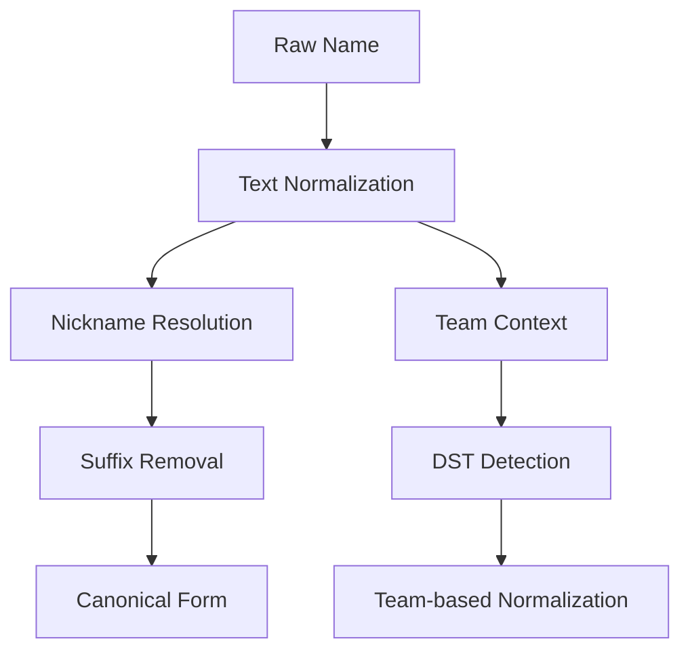

# CSV Match - Architecture

## System Architecture
CSV Match is a client-only web application with no backend requirements. The architecture is designed for simplicity and performance:

```
┌─────────────────┐    ┌─────────────────┐    ┌─────────────────┐
│   User Input    │ -> │  Data Processing│ -> │  Output & Export│
│   (CSV Upload)  │    │  (Matching Engine)│    │  (Merged CSV)  │
└─────────────────┘    └─────────────────┘    └─────────────────┘
         │                       │                       │
         ▼                       ▼                       ▼
┌─────────────────┐    ┌─────────────────┐    ┌─────────────────┐
│ Configuration   │    │ Normalization   │    │ Persistence     │
│ (Sport, Columns)│    │ (Names, Teams)  │    │ (Aliases, Theme)│
└─────────────────┘    └─────────────────┘    └─────────────────┘
```

## Core Components

### 1. Main Application ([`index.html`](../index.html))
- **Single HTML file** containing all application logic
- **Responsive UI** with dark/light theme support
- **Four-phase workflow**: Upload → Configure → Match → Export

### 2. Data Processing Engine
- **CSV Parser**: PapaParse library for file handling
- **Fuzzy Matcher**: Fuse.js for approximate string matching
- **Normalization Pipeline**: Name and team standardization

### 3. Data Storage Layer
- **Team Mappings**: JSON files for each sport (`nfl_teams.json`, etc.)
- **Name Normalization**: Generated datasets (`nicknames_common.json`, `suffixes.json`)
- **User Aliases**: Browser localStorage for persistent custom mappings

## Key Technical Decisions

### Name Normalization Strategy


### Team Matching Approach
- **Canonical Team Codes**: All teams mapped to 3-letter codes
- **Comprehensive Aliases**: Multiple name variations per team
- **Team Isolation**: Fuzzy matching restricted to same team to prevent cross-sport collisions

### Defense/Special Teams (DST) Handling
- **Pattern Recognition**: Regex detection of D/ST patterns
- **Team-based Resolution**: DST names normalized to full team names
- **Special Case**: "Baltimore D/ST" → "Baltimore Ravens"

## Critical Implementation Paths

### 1. Matching Pipeline ([`index.html:574-655`](../index.html:574-655))
- Build indexes for both files
- Apply normalization and aliases
- Perform exact then fuzzy matching
- Generate review items for ambiguous matches

### 2. Name Composition ([`index.html:532-542`](../index.html:532-542))
- Support for single-column or multi-column names
- Configurable separator for composed names
- Dynamic UI based on selection mode

### 3. Data Export ([`index.html:709-717`](../index.html:709-717))
- Column prefixing for source identification
- Match reason tracking for debugging
- Manifest generation for match statistics

## Component Relationships

### Data Flow
1. **User Uploads** → CSV parsing → Column detection
2. **Configuration** → Sport selection → Column mapping
3. **Matching** → Normalization → Index building → Fuzzy search
4. **Review** → Manual resolution → Alias storage
5. **Export** → Data merging → File download

### Dependencies
- **PapaParse**: External CDN for CSV parsing
- **Fuse.js**: External CDN for fuzzy matching
- **Local Storage**: Browser-native for alias persistence
- **Team Data**: Local JSON files loaded dynamically

## Design Patterns

### Builder Pattern
- Name getter functions constructed based on user configuration
- Team index builders with fuse.js integration

### Strategy Pattern
- Different normalization strategies for players vs D/ST
- Multiple name composition methods

### Observer Pattern
- UI updates based on file upload and configuration changes
- Real-time matching status updates